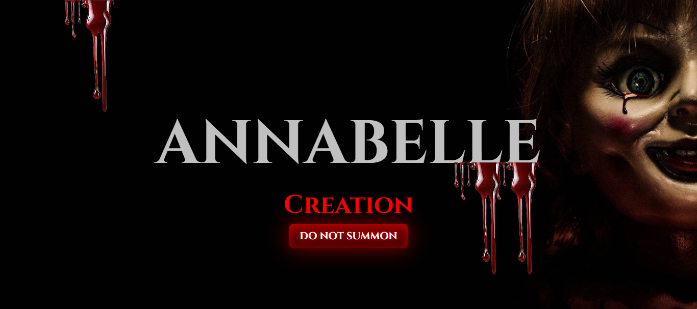

# 🎨 Hero Section — Assignment 2

This is my **second assignment** from the Full Stack Web Development course.  
It’s a **Hero Section** inspired by the **Annabel Theme**, created using only **HTML** and **CSS**.

---

## 📋 Project Overview

The goal of this assignment was to:

- Recreate a modern **Hero Section layout**
- Practice CSS positioning and layout techniques
- Use **fonts, colors, and spacing** effectively
- Build a visually appealing static landing section

---

## 🧱 Tech Stack

- **HTML5**
- **CSS3**

---

## 🚀 Features

- Responsive Hero Section layout  
- Custom typography and background styling  
- Centered headline, subtext, and button  
- Inspired by **Annabel Theme** aesthetic  

## 🖼️ Preview

<!-- ## 🌐 Live Demo

You can view the live version of this project here:

👉 **[View Live Project](https://kahkasha17.github.io/Shery-Portfolio-Assignment1/)**  
_(Hosted using GitHub Pages)_ -->

## 🧠 What I Learned

- Writing clean and semantic **HTML**
- Linking external **CSS** files
- Structuring a resume layout using **HTML elements**
- Using basic **CSS properties** for styling

## 🔮 Next Steps

- Add **media queries** for mobile responsiveness  
- Include **scroll animations** or **hover effects**  
- Integrate **JavaScript** interactions in future tasks

## 💡 Author

**[Kahkasha Khan]**  
*Full Stack Web Development Learner*  

📧 **codewithkahkasha1711@gmail.com**  
🌍 [https://github.com/kahkasha17](https://github.com/kahkasha17)

---

⭐ **If you like this project, don't forget to give it a star!**
