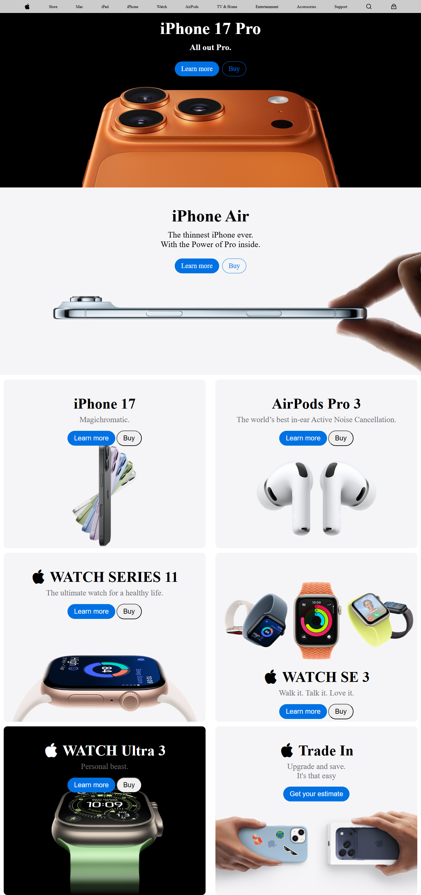

# 🍏 Apple Product Landing Page — Assignment 3

This is my **third assignment** from the Full Stack Web Development course.  
It’s a **landing page inspired by Apple’s official website**, showcasing the **iPhone 17 Pro**, **AirPods Pro 3**, and **Apple Watch Series** — created using **only HTML and CSS**.

---

## 📋 Project Overview

The goal of this assignment was to:
- Recreate a **modern, clean, product-focused landing page**
- Practice **HTML structure** and **CSS layout techniques**
- Understand **image alignment**, **button styling**, and **font hierarchy**

---

## 🧱 Tech Stack

- **HTML5**
- **CSS3**

---

## 🚀 Features

- Elegant and minimal **Apple-style UI**
- Multiple product sections (iPhone, AirPods, Watch)
- Reusable button design (`Learn more` / `Buy`)
- Simple **responsive layout**
- Consistent **font and spacing system**

## 🖼️ Preview

<!-- ## 🌐 Live Demo

You can view the live version of this project here:

👉 **[View Live Project](https://kahkasha17.github.io/Shery-Portfolio-Assignment1/)**  
_(Hosted using GitHub Pages)_ -->

## 🧠 What I Learned

- Building **multi-section landing pages** with semantic HTML  
- Applying **flexbox and grid** for structured layouts  
- Maintaining **visual balance** through consistent spacing and typography  
- Creating **reusable styles** for buttons and product cards  
- Using **images effectively** without breaking layout flow  

## 🔮 Next Steps

- Add **animations / hover effects** for interactive feel  
- Include **JavaScript** for dynamic navigation or carousels  
- Improve **mobile responsiveness**  
- Add **footer** and product links  

## 💡 Author

**[Kahkasha Khan]**  
*Full Stack Web Development Learner*  

📧 **codewithkahkasha1711@gmail.com**  
🌍 [https://github.com/kahkasha17](https://github.com/kahkasha17)

---

⭐ **If you like this project, don't forget to give it a star!**
