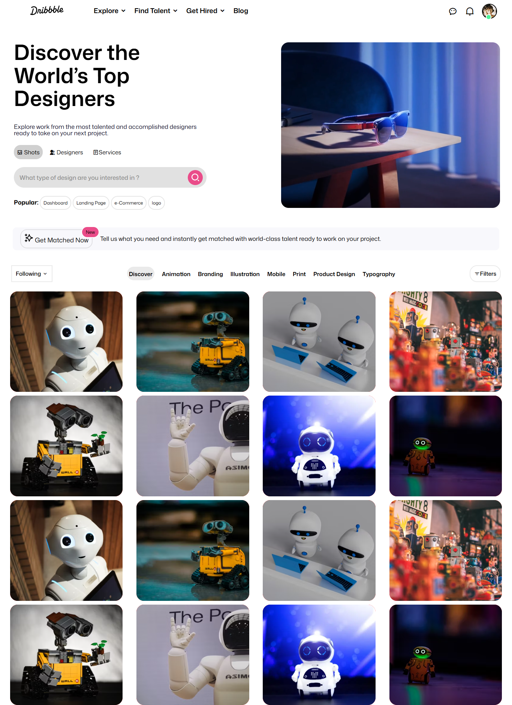

# 🎯 Dribbble Clone — Assignment 5

This is my **fifth assignment** from the Full Stack Web Development course — a visual portfolio / shots gallery inspired by **Dribbble**, built using **HTML, CSS**.

---

## 📋 Project Overview

A pixel-perfect style gallery showcasing design “shots” with cards, hover effects, and responsive layout.  
The goal was to recreate the look & feel of Dribbble’s shots grid and practice UI layouts, hover interactions, and responsive design.

---

## 🧱 Tech Stack

- **HTML5**
- **CSS3** (Flexbox /transitions)

---

## 🚀 Features

- Grid of shot cards with images, titles, and author info  
- Hover effects (scale / shadow / reveal buttons)  
- Modal / lightbox for shot preview  
- Clean, minimal UI inspired by Dribbble

## 🖼️ Preview

<!-- ## 🌐 Live Demo

You can view the live version of this project here:

👉 **[View Live Project](https://kahkasha17.github.io/Shery-Portfolio-Assignment1/)**  
_(Hosted using GitHub Pages)_ -->

## 🧠 What I Learned

- Creating smooth **hover transitions** and interactive UI states  
- Organizing assets and reusable component styles

## 🔮 Next Steps

- Include **JavaScript** for dynamic contents 
- Improve **mobile responsiveness**  
- Add **footer** and product links  

## 💡 Author

**[Kahkasha Khan]**  
*Full Stack Web Development Learner*  

📧 **codewithkahkasha1711@gmail.com**  
🌍 [https://github.com/kahkasha17](https://github.com/kahkasha17)

---

⭐ **If you like this project, don't forget to give it a star!**
