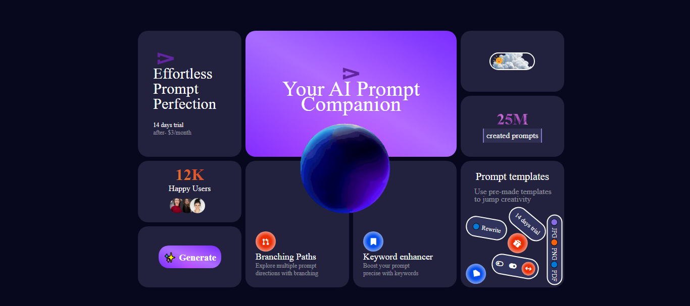

# 🤖 AI Prompt Companion — Assignment 6

This is my **6th assignment** from the Full Stack Web Development course — a modern **landing page layout** built using **CSS Grid**.  
The design showcases a futuristic “AI Prompt Companion” theme with stats, call-to-action buttons, and creative grid alignment.

---

## 📋 Project Overview

A visually rich hero section made entirely with **HTML & CSS Grid**, focused on responsiveness, card alignment, and aesthetic UI structure.  
This project helped me understand **grid-template areas**, **column/row spans**, and **layering visual hierarchy**.
---

## 🧱 Tech Stack

- **HTML5**
- **CSS3 (Grid + Flexbox for minor alignment)**

---

## 🚀 Features

- Fully **grid-based layout**  
- Clean, modern **dark UI theme**  
- Reusable **card components**  
- **Hover and color transitions** for interactivity  
- Designed for scalability and easy customization

---

## 🧠 What I Learned

- How to structure layouts using **CSS Grid**  
- Using **grid-template-columns**, **rows**, and **areas** efficiently  
- Balancing **typography and visual hierarchy**  
- Maintaining **consistency** across cards and sections  

## 🖼️ Preview

<!-- ## 🌐 Live Demo

You can view the live version of this project here:

👉 **[View Live Project](https://kahkasha17.github.io/Shery-Portfolio-Assignment1/)**  
_(Hosted using GitHub Pages)_ -->

## 🧠 What I Learned

- Writing clean and semantic **HTML**
- Linking external **CSS** files
- Structuring a resume layout using **HTML elements**
- Using basic **CSS properties** for styling

## 🔮 Next Steps

- Add **responsive design** using media queries  
- Enhance **UI** with animations and improved color palettes  
- Integrate **JavaScript** for interactivity in future assignments

## 💡 Author

**[Kahkasha Khan]**  
*Full Stack Web Development Learner*  

📧 **codewithkahkasha1711@gmail.com**  
🌍 [https://github.com/kahkasha17](https://github.com/kahkasha17)

---

⭐ **If you like this project, don't forget to give it a star!**
