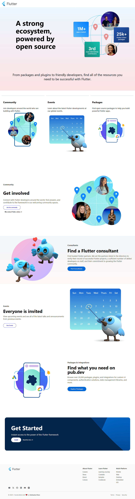
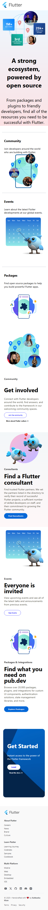

# 🌈 Flutter Open Source Website Clone  

A modern, responsive **Flutter community website clone** built using **HTML**, **CSS**, and **SCSS**.  
This project recreates the clean, structured, and animated layout of the official Flutter ecosystem website — designed to highlight community, events, and open-source tools.  

---

## 🧱 Tech Stack

- **HTML5**  
- **CSS3**  
- **SCSS (SASS)**  
- **Flexbox & CSS Grid** 

---

## 🚀 Features

- 💻 Fully responsive design for all devices  
- 🎨 Modern, minimal, and clean layout inspired by Flutter  
- 🧩 SCSS modular styling for maintainable code  
- 🪄 Smooth hover and transition animations  
- 🧭 Built using CSS Grid & Flexbox combination  
- 📱 Optimized for mobile, tablet, and desktop  

---

## 🧠 What I Learned

- Structuring complex layouts using **CSS Grid & Flexbox**  
- Organizing styles effectively with **SCSS partials**  
- Implementing a **responsive, scalable** web layout  
- Using modern **UI/UX principles** to recreate real-world designs  

## 🖼️ Project Preview  

### 💻 Laptop View  

### 📱 Mobile View  

<!-- ## 🌐 Live Demo

You can view the live version of this project here:

👉 **[View Live Project](https://kahkasha17.github.io/Shery-Portfolio-Assignment1/)**  
_(Hosted using GitHub Pages)_ -->

## 🔮 Next Steps  

- ✨ Add scroll animations using **GSAP** or **AOS.js**  
- 🌗 Include **Dark/Light Mode Toggle**  
- 📰 Add a **Blog Section** for updates and posts  
- 📨 Add **form functionality** for the contact section  

## 💡 Author

**[Kahkasha Khan]**  
*Full Stack Web Development Learner*  

📧 **codewithkahkasha1711@gmail.com**  
🌍 [https://github.com/kahkasha17](https://github.com/kahkasha17)

---

⭐ **If you like this project, don't forget to give it a star!**
