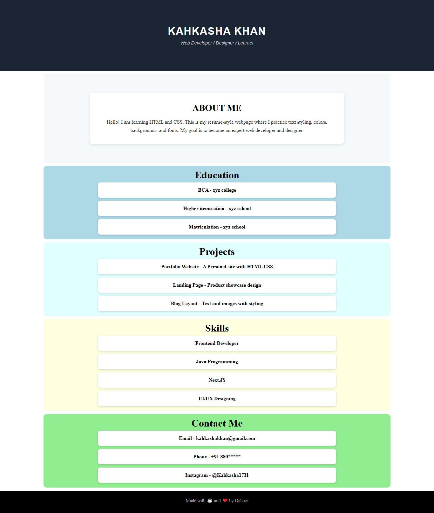

# 🧑‍💻 Portfolio Resume — Assignment 1

This is my **first assignment** from the Full Stack Web Development course.  
It’s a simple **Resume-style Portfolio Website** built using only **HTML** and a bit of **CSS**.

---

## 📋 Project Overview

The goal of this assignment was to:

- Practice basic **HTML structure**
- Learn how to organize content semantically
- Apply simple **CSS styling** for layout and typography
- Build a personal **portfolio/resume** webpage

---

## 🧱 Tech Stack

- **HTML5**
- **CSS3**

---

## 🚀 Features

- Clean and responsive structure
- Sections for:
  - 👋 Introduction / About Me
  - 🎓 Education
  - 💼 Experience or Projects
  - 📞 Contact Details
- Simple CSS styling (colors, fonts, alignment)

---

## 🖼️ Preview

_(You can add a screenshot here once deployed or by linking a local image)_  
Example:

```md


## 🌐 Live Demo

You can view the live version of this project here:

👉 **[View Live Project](https://kahkasha17.github.io/Shery-Portfolio-Assignment1/)**  
_(Hosted using GitHub Pages)_
```

## 🧠 What I Learned

- Writing clean and semantic **HTML**
- Linking external **CSS** files
- Structuring a resume layout using **HTML elements**
- Using basic **CSS properties** for styling

---

## 🔮 Next Steps

- Add **responsive design** using media queries  
- Enhance **UI** with animations and improved color palettes  
- Integrate **JavaScript** for interactivity in future assignments

---

## 💡 Author

**[Kahkasha Khan]**  
*Full Stack Web Development Learner*  

📧 **youremail@example.com**  
🌍 [Your GitHub Profile](https://github.com/kahkasha17)


---

⭐ **If you like this project, don't forget to give it a star!**
