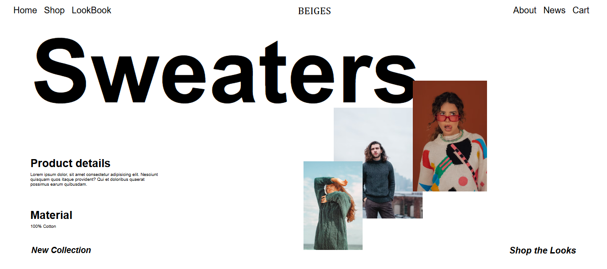

# 👕 Sweaters Hero Section — In-Class Task

This project is an **in-class task** from my Full Stack Web Development course.  
It’s a **Hero Section** for a clothing website called **“BEIGES”**, created using **only HTML and CSS** — focused mainly on **layout and positioning**.

---

## 📋 Project Overview

The goal of this assignment was to:

- Practice **CSS positioning techniques** (relative, absolute)
- Align images and text visually within a hero layout
- Create a **minimal and modern landing section**

---

## 🧱 Tech Stack

- **HTML5**
- **CSS3**(Positioning & Layout)

---

## 🚀 Features

- Hero section with layered **image composition**
- Bold **typography** for product name (“Sweaters”)
- Clean **navigation bar**
- Section details with subtle text alignment

## 🖼️ Preview

<!-- ## 🌐 Live Demo

You can view the live version of this project here:

👉 **[View Live Project](https://kahkasha17.github.io/Shery-Portfolio-Assignment1/)**  
_(Hosted using GitHub Pages)_ -->

## 🧠 What I Learned

- Using **position: relative / absolute** effectively  
- Managing **z-index** for overlapping elements  
- Structuring layouts without frameworks  
- Balancing text and imagery in design

## 🔮 Next Steps

- Add **media queries** for mobile responsiveness  
- Include **scroll animations** or **hover effects**  
- Integrate **JavaScript** interactions in future tasks

## 💡 Author

**[Kahkasha Khan]**  
*Full Stack Web Development Learner*  

📧 **codewithkahkasha1711@gmail.com**  
🌍 [https://github.com/kahkasha17](https://github.com/kahkasha17)

---

⭐ **If you like this project, don't forget to give it a star!**
