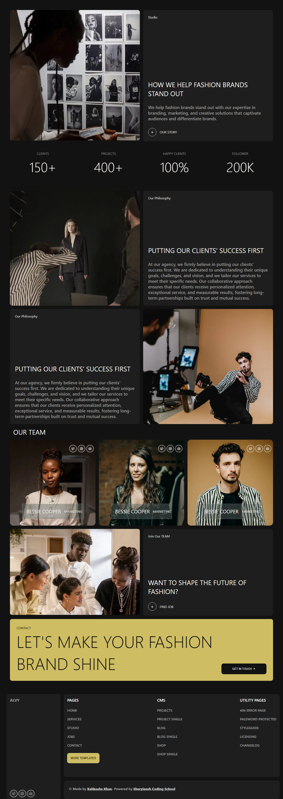

# 👗 Fashion Brand Agency Website

This is a **fully responsive Fashion Brand Agency Website** built using **HTML, CSS Grid, Flexbox, and SCSS**.  
It highlights modern design principles, professional typography, and a clean, luxurious aesthetic — perfect for fashion or creative agency portfolios.

---

## 🧱 Tech Stack

- **HTML5** — semantic structure  
- **SCSS (Sass)** — for cleaner, modular, and maintainable styling  
- **CSS Grid** — for multi-section responsive layouts  
- **Flexbox** — for alignment and spacing  
- **Media Queries** — for responsiveness across all screen sizes  

---

## 🚀 Features

This project showcases a **Fashion Agency landing page** with multiple sections including:
- **Hero Section** — bold visuals and agency introduction  
- **Stats Section** — client, project, and follower highlights  
- **Our Philosophy & Studio Sections** — company values and mission  
- **Team Section** — member cards with hover social icons  
- **Join Our Team Section** — career and hiring promotion  
- **Contact CTA Section** — bold banner encouraging user engagement  
- **Footer Section** — site navigation and credits  

The design is powered by **Grid and Flexbox** for a perfect balance of structure and flexibility.

## 🖼️ Preview

## 🌐 Live Demo

You can view the live version of this project here:

👉 **[View Live Project](https://kahkasha17.github.io/alvy-fashion-brand/)**  
_(Hosted using GitHub Pages)_

## 🔮 Next Steps

- **Add scroll animations** using **GSAP** or **AOS.js** — enhance entrance/scroll effects for sections and cards to improve engagement.  
- **Include a blog section or CMS integration** (e.g., Netlify CMS, Contentful, or a simple Markdown-based blog) — for posting case studies and updates.  
- **Create a light/dark mode toggle** using CSS variables (custom properties) + a small JS switch to persist user preference.  
- **Add form functionality for the contact section** — client-side validation + connect to EmailJS or a backend (Node/Express or serverless function) to send messages.

## 💡 Author

**[Kahkasha Khan]**  
*Full Stack Web Development Learner*  

📧 **codewithkahkasha1711@gmail.com**  
🌍 [https://github.com/kahkasha17](https://github.com/kahkasha17)

---

⭐ **If you like this project, don't forget to give it a star!**
