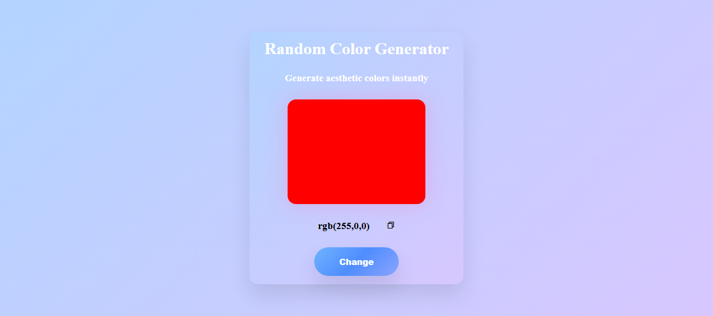

# 🎨 Random Color Generator

This is a **fully responsive Random Color Generator Web App** built using **HTML, SCSS, and JavaScript**.  
It features a clean **glassmorphism UI**, smooth transitions, and generates aesthetic color combinations instantly — perfect for UI designers, developers, and color-palette inspiration.

---

## 🧱 Tech Stack

- **HTML5** — semantic structure  
- **SCSS (Sass)** — cleaner, modular, maintainable styling  
- **JavaScript (ES6)** — dynamic color generation and interactions  
- **Flexbox** — layout alignment and spacing  
- **Media Queries** — full responsiveness across all screen sizes  

---

## 🚀 Features

This project includes a **random color generator tool** with:

- **Glassmorphism UI Card** — modern and aesthetic design  
- **Dynamic Color Box** — updates instantly with each click  
- **RGB Value Display** — shows real-time color codes  
- **Copy to Clipboard** — copy the generated color easily  
- **Responsive Layout** — optimized for all devices  

The UI focuses on **minimalism + modern visual appeal**, suitable for color tools or design utility projects.

---

## 🖼️ Preview

---

## 🌐 Live Demo

You can view the live version of this project here:

👉 **[View Live Project](https://kahkasha17.github.io/Random-Color-Generator/)**  
_(Hosted using GitHub Pages)_

---

## 🔮 Next Steps

- **Add HEX & HSL color formats** — give users more options  
- **Save Color Palette Feature** — store favorite colors  
- **Gradient Generator Mode** — generate linear/radial gradients  
- **LocalStorage Integration** — save history of generated colors  
- **Add GSAP or AOS.js animations** — enhance UI motion  
- **Add share buttons** — copy link or share color on social apps  

---

## 💡 Author

**Kahkasha Khan**  
*Front-End & MERN Stack Developer*  

📧 **codewithkahkasha1711@gmail.com**  
🌍 https://github.com/kahkasha17

---

⭐ **If you like this project, don't forget to give it a star!**
