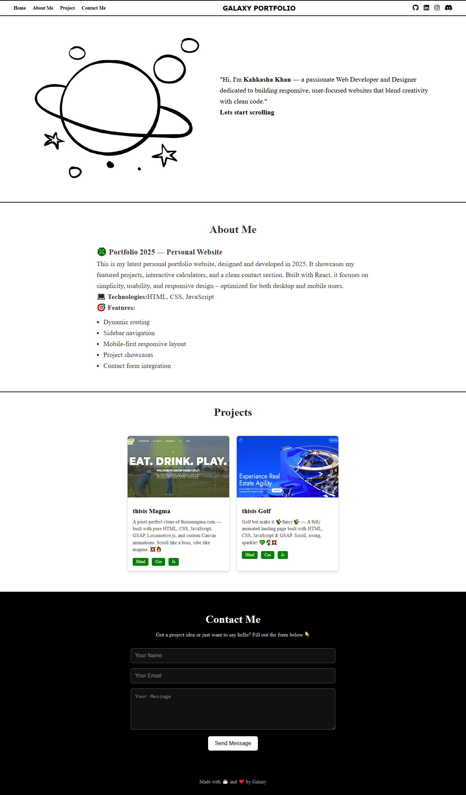

# 🌌 Galaxy Portfolio — Personal Website

This is my **self-practice project** — a personal portfolio website named **Galaxy Portfolio**.  
It’s designed and developed entirely by me to showcase my work, creativity, and learning in **HTML, and CSS**.

---

## 📋 Project Overview

**Galaxy Portfolio** highlights:
- A clean, modern, and responsive **personal website**
- My featured projects and skills
- A working contact form section
- Smooth scrolling and aesthetic layout

Built to practice real-world portfolio structure and responsive design.
---

## 🧱 Tech Stack

- **HTML5**
- **CSS3**

---

## 🚀 Features

- 🌠 Interactive hero section with intro and smooth scroll  
- 🪐 “About Me” section with project details  
- 💼 Project cards showcasing past works  
- 📬 Contact form design  
- 🔄 Responsive layout for all screen sizes  

## 🖼️ Preview

## 🌐 Live Demo

You can view the live version of this project here:

👉 **[View Live Project](https://kahkasha17.github.io/Portfolio-by-scratch/)**  
_(Hosted using GitHub Pages)_

## 🧠 What I Learned

- Structuring a **multi-section portfolio layout**  
- Styling for **professional UI/UX** with minimal design  
- Adding **smooth scrolling** and dynamic page flow  
- Balancing **typography, colors, and spacing**  

## 🔮 Next Steps

- Add dark/light mode toggle  
- Include animations using GSAP or ScrollReveal  
- Connect contact form to backend (EmailJS / Node.js)  
- Add blog section or testimonials

## 💡 Author

**[Kahkasha Khan]**  
*Full Stack Web Development Learner*  

📧 **codewithkahkasha1711@gmail.com**  
🌍 [https://github.com/kahkasha17](https://github.com/kahkasha17)

---

⭐ **If you like this project, don't forget to give it a star!**
